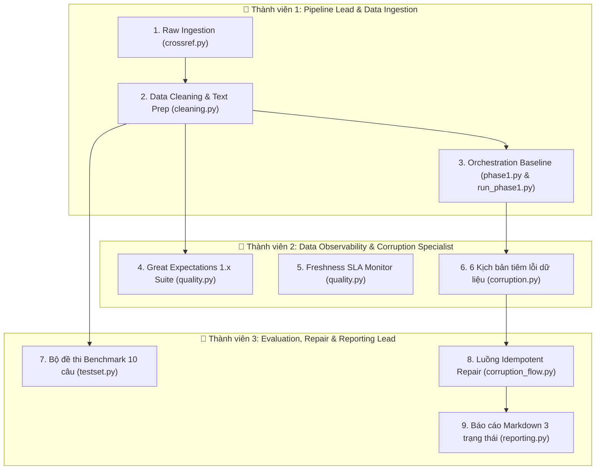

# KẾ HOẠCH DỰ ÁN CHI TIẾT (TEAMWORK 3 NGƯỜI)
## Day 10 — Data Pipeline & Data Observability for RAG

> **Mã môn:** AI-ENGINEER-K4 — VinUni  
> **Thời lượng thực chiến:** 240 phút (4 giờ)  
> **Hạn nộp bài:** 23:59:59 ngày diễn ra bài lab (trên hệ thống VLearn LMS)  
> **Thang điểm:** 100 điểm chuẩn (bắt buộc) + 10 điểm thưởng (Bonus)  
> **Quy định sống còn:** Dù làm chung 1 GitHub Repository, **100% thành viên phải tự tay nộp đường link repo lên VLearn LMS** bằng tài khoản cá nhân.

---

## 🗺️ 1. TỔNG QUAN BÀI TOÁN & MỤC TIÊU CỐT LÕI

### 1.1. Bối cảnh & Hiểm họa "Silent Failure"
Trong các hệ thống RAG (Retrieval-Augmented Generation) thực tế, nếu dữ liệu đầu vào bị lỗi (dữ liệu cũ, thiếu tóm tắt, trùng lặp, nhiễu văn bản), AI Agent **không hề báo lỗi đỏ (`Exception`)**. Thay vào đó, nó vẫn trả lời trôi chảy nhưng nội dung hoàn toàn sai sự thật (**Hallucination** / Stale Data). Đó chính là **Silent Failure (Thất bại thầm lặng)** — lỗi nguy hiểm nhất trong MLOps.

### 1.2. Sứ mệnh của nhóm (7 Tầng dữ liệu)
Nhóm 3 người sẽ xây dựng một Data Pipeline chuẩn công nghiệp cho dữ liệu bài báo khoa học từ **Crossref Academic API**:
1. **Raw Preservation:** Lưu trữ nguyên gốc dữ liệu API vào `data/raw/` để bảo toàn Data Lineage.
2. **Data Cleaning:** Chuẩn hóa text, loại bỏ tag XML thừa, tính `age_days`, ghép `text_for_embedding`.
3. **Data Quality Gate:** Cài đặt chốt kiểm định bằng **Great Expectations 1.x** (chuẩn mới Ephemeral) và giám sát **Freshness SLA** (`age_days > 180`).
4. **Vector Indexing:** Nhúng ngữ nghĩa bằng `sentence-transformers/all-MiniLM-L6-v2` và lưu vào ChromaDB.
5. **Evaluation Benchmark:** Tạo bộ 10 câu hỏi đa dạng và đo lường chỉ số nền (Hit Rate, Token F1, LLM Judge).
6. **Synthetic Corruption:** Chủ động tiêm 6 kịch bản lỗi thực tế để chứng kiến AI sụt giảm phong độ.
7. **Idempotent Repair & Comparison:** Tự động phục hồi dữ liệu từ bản sao lưu thô ban đầu và xuất báo cáo đối chiếu 3 trạng thái: **Dữ liệu Sạch (Baseline) vs Dữ liệu Lỗi (Corrupted) vs Sau Phục Hồi (Repaired)**.

---

## 👥 2. PHÂN CHIA VAI TRÒ & PHẠM VI CÔNG VIỆC CHO 3 THÀNH VIÊN



---

### 👤 THÀNH VIÊN 1: Pipeline Lead & Data Ingestion (Trưởng Nhóm)
* **Trách nhiệm cốt lõi:** Quản lý môi trường, thu thập dữ liệu gốc, chuẩn hóa làm sạch và điều phối luồng Baseline Phase 1.
* **Các file code phụ trách:**
  - `src/ingestion/crossref.py`:
    - `parse_crossref_payload()`: Bóc tách DOI, title, abstract (bỏ tag `<jats:p>`), authors, published date, category.
    - `fetch_source_records()`: Gọi Crossref REST API có retry và cơ chế fallback đọc từ snapshot local `data/raw/crossref_response.json` khi API quá tải/mất mạng.
    - Lưu 2 file raw artifacts: `data/raw/crossref_response.json` và `data/raw/crossref_records.json`.
    - `load_raw_records()`: Đọc snapshot JSON và chuyển thành danh sách `PaperRecord`.
  - `src/ingestion/cleaning.py`:
    - `build_clean_dataframe()`: Làm sạch khoảng trắng thừa, parse ngày tháng, tính toán `age_days = (run_date - published).days`.
    - Ghép nối cấu trúc 5 phần vào cột `text_for_embedding` (Title, Authors, Published, Categories, Summary).
    - Khử trùng lặp theo `paper_id` duy nhất, xuất ra `data/clean/papers_clean.csv` và `papers_clean.json`.
  - `src/pipelines/phase1.py` & `script/run_phase1.py`:
    - Kết nối luồng Phase 1: Ingestion $\rightarrow$ Clean $\rightarrow$ ChromaDB Index $\rightarrow$ Quality Gate $\rightarrow$ Test Set $\rightarrow$ Evaluate $\rightarrow$ Xuất báo cáo.
* **Lệnh kiểm tra (Self-Verification):**
  ```powershell
  # Kiểm tra môi trường
  python -c "import chromadb, great_expectations, sentence_transformers; print('Môi trường sẵn sàng')"
  # Kiểm tra Ingestion tải đủ 24 bài báo
  python -c "from core.config import load_settings; from ingestion.crossref import fetch_source_records; s=load_settings(); r=fetch_source_records(s); print(f'Tín hiệu hoàn thành: Đã tải {len(r)} bài báo')"
  # Kiểm tra Clean dataframe 24 dòng
  python -c "from datetime import datetime, timezone; from core.config import load_settings; from ingestion.crossref import load_raw_records; from ingestion.cleaning import build_clean_dataframe; s=load_settings(); df=build_clean_dataframe(load_raw_records(s.paths.raw_records_json), datetime.now(timezone.utc)); print(f'Tín hiệu hoàn thành: Clean thành công {len(df)} dòng')"
  ```

---

### 👤 THÀNH VIÊN 2: Data Observability & Corruption Specialist
* **Trách nhiệm cốt lõi:** Thiết lập trạm kiểm soát chất lượng dữ liệu (Quality Gate), theo dõi độ tươi (Freshness SLA) và thiết kế bộ tiêm 6 kịch bản lỗi giả lập sự cố thực tế.
* **Các file code phụ trách:**
  - `src/observability/quality.py`:
    - Cấu hình Great Expectations 1.x chuẩn Ephemeral Context:
      ```python
      context = gx.get_context(mode="ephemeral")
      data_source = context.data_sources.add_pandas(name="papers_source")
      data_asset = data_source.add_dataframe_asset(name="papers_asset")
      batch_def = data_asset.add_batch_definition_whole_dataframe("papers_batch")
      batch = batch_def.get_batch(batch_parameters={"dataframe": df})
      ```
    - Thiết lập **4 Expectations thiết yếu**:
      1. `ExpectTableRowCountToBeBetween` (min_value=5, max_value=5000).
      2. `ExpectColumnValuesToNotBeNull` cho `paper_id`, `title`, `text_for_embedding`.
      3. `ExpectColumnValuesToBeUnique` cho `paper_id`.
      4. `ExpectColumnValueLengthsToBeBetween` cho `summary` (min_value=30).
    - `build_freshness_report()`: Tính tỷ lệ bản ghi có `age_days > 180` (quá hạn 6 tháng). Nếu tỷ lệ bài cũ $> 25\%$, gắn cờ cảnh báo `is_fresh = False`. Xuất ra `data/quality/freshness_report.json`.
  - `src/ingestion/corruption.py`:
    - `corrupt_clean_dataframe()`: Triển khai đủ **6 kịch bản làm bẩn dữ liệu**:
      1. *Drop latest records:* Loại bỏ 20% bản ghi mới nhất.
      2. *Blank summary:* Xóa rỗng trường tóm tắt ở một số dòng.
      3. *Inject noise:* Chèn các chuỗi ký tự rác vô nghĩa vào tóm tắt.
      4. *Truncate title:* Cắt ngắn tiêu đề bài báo xuống dưới 8 ký tự.
      5. *Stale date:* Lùi ngày xuất bản về quá khứ 365 ngày (vi phạm Freshness SLA).
      6. *Duplicate rows:* Nhân bản các dòng ngẫu nhiên để gây trùng lặp.
    - Cập nhật lại cột `text_for_embedding` sau khi tiêm lỗi và ghi nhật ký chi tiết vào `data/results/corruption_log.json`.
* **Lệnh kiểm tra (Self-Verification):**
  ```powershell
  # Kiểm tra Quality Gate trên clean data (phải ra True)
  python -c "from core.config import load_settings; from observability.quality import run_data_quality_checks; import pandas as pd; s=load_settings(); df=pd.read_json(s.paths.clean_json); res=run_data_quality_checks(df, s, 'test'); print(f'Tín hiệu hoàn thành: Quality check status = {res[\"success\"]}')"
  # Kiểm tra tiêm 6 lỗi dữ liệu
  python -c "from core.config import load_settings; from ingestion.corruption import corrupt_clean_dataframe; import pandas as pd; s=load_settings(); df=pd.read_json(s.paths.clean_json); c=corrupt_clean_dataframe(df, s.paths.corruption_log); print(f'Tín hiệu hoàn thành: Corrupted {len(c)} dòng')"
  ```

---

### 👤 THÀNH VIÊN 3: Evaluation, Repair & Reporting Lead
* **Trách nhiệm cốt lõi:** Xây dựng bộ đề thi đánh giá RAG, lập trình luồng phục hồi dữ liệu an toàn (Idempotent Repair) và tổng hợp báo cáo đối chiếu định lượng 3 trạng thái.
* **Các file code phụ trách:**
  - `src/evaluation/testset.py`:
    - `build_test_set()`: Tạo bộ 10 câu hỏi benchmark đa dạng phủ đủ **4 nhóm nghiệp vụ**:
      1. `summary`: Hỏi tóm tắt nội dung chính của bài báo.
      2. `authors`: Hỏi danh sách tác giả của nghiên cứu.
      3. `date`: Hỏi thời điểm/năm công bố bài báo.
      4. `categories`: Hỏi về lĩnh vực phân loại chuyên môn.
    - Mỗi câu hỏi bao gồm: `id`, `question_type`, `question`, `ground_truth`, `ground_truth_doc_ids`. Lưu vào `data/eval/test_set.json`.
  - `src/observability/reporting.py`:
    - `generate_phase1_report()`: Tổng hợp số liệu Phase 1, số lượng bản ghi, chỉ số Hit Rate, Token F1 và kết quả GX 1.x vào `data/reports/phase1_report.md`.
    - `generate_corruption_report()`: Tạo báo cáo markdown so sánh đối đầu giữa 3 trạng thái (**Baseline vs Corrupted vs Repaired**) vào `data/reports/corruption_report.md`.
  - `src/pipelines/corruption_flow.py` & `script/run_corruption_flow.py`:
    - Điều phối luồng Phase 2:
      1. Nạp dữ liệu bẩn vào collection ChromaDB riêng biệt: `papers-corrupted`.
      2. Chạy đánh giá đo lường sự sụt giảm nghiêm trọng của Hit Rate & Token F1 (ghi ra `corrupted_metrics.json`).
      3. Kích hoạt cơ chế **Idempotent Repair**: Tái tạo lại dữ liệu sạch từ bản lưu trữ thô ban đầu `data/raw/crossref_records.json` (chạy lại bao nhiêu lần kết quả vẫn chuẩn sạch).
      4. Nạp lại vào collection `papers-repaired` và chạy đánh giá phục hồi (`repaired_metrics.json`).
      5. Gọi hàm xuất báo cáo đối chiếu 3 trạng thái hoàn chỉnh.
* **Lệnh kiểm tra (Self-Verification):**
  ```powershell
  # Kiểm tra sinh bộ test set 10 câu
  python -c "from core.config import load_settings; from evaluation.testset import build_test_set; import pandas as pd; s=load_settings(); df=pd.read_json(s.paths.clean_json); ts=build_test_set(df, s.paths.eval_testset); print(f'Tín hiệu hoàn thành: Sinh được {len(ts)} câu hỏi test')"
  # Chạy thử toàn bộ luồng Corruption & Repair
  python script/run_corruption_flow.py
  ```

---

## ⏱️ 3. LỘ TRÌNH THỰC HIỆN THEO 7 CHECKPOINTS (TIMELINE 240 PHÚT)

| Thời gian | Checkpoint | Thành viên 1 (Ingestion & Lead) | Thành viên 2 (Observability & Corruption) | Thành viên 3 (Evaluation & Repair) | Sản phẩm bàn giao (Deliverables) |
| :---: | :---: | :--- | :--- | :--- | :--- |
| **0' – 30'** | **CP0** | Setup repo nhóm, add collaborator, kích hoạt venv, tạo `.env`, viết `crossref.py` | Clone repo, kích hoạt venv, cấu hình `.env`, nghiên cứu tài liệu GX 1.x | Clone repo, kích hoạt venv, cấu hình `.env`, nghiên cứu cấu trúc test set | In ra `Môi trường sẵn sàng`, tải đủ 24 bài báo vào `data/raw/` |
| **30' – 65'** | **CP1** | Viết `cleaning.py` (loại XML, tính `age_days`, tạo `text_for_embedding`) | Viết `quality.py` (GX 1.x Ephemeral Context + Freshness SLA) | Đọc `index.py` & `qa.py`, phác thảo 10 câu hỏi mẫu theo 4 nhóm | `papers_clean.csv`, GX 1.x validation status `True` |
| **65' – 95'** | **CP2** | Push `papers_clean.csv`, hỗ trợ kiểm tra collection ChromaDB | Bắt đầu viết khung 6 hàm tiêm lỗi trong `corruption.py` | Hoàn thiện `testset.py`, xuất file `data/eval/test_set.json` (10 câu) | `test_set.json`, Index thành công ChromaDB 24 docs sạch |
| **95' – 120'** | **CP3** | Ghép nối `phase1.py`, chạy thử nghiệm `python script/run_phase1.py` | Kiểm tra kết quả Quality Gate & Freshness report | Viết hàm `generate_phase1_report` trong `reporting.py` | `baseline_metrics.json`, `phase1_report.md` |
| **120' – 165'** | **CP4** | Cùng review log lỗi, chuẩn bị logic đọc lại từ raw data để repair | Hoàn thiện 6 kịch bản tiêm lỗi trong `corruption.py`, xuất `corruption_log.json` | Nạp data bẩn vào `papers-corrupted`, đo lường chỉ số sụt giảm `corrupted_metrics.json` | `corruption_log.json`, `corrupted_metrics.json` |
| **165' – 210'** | **CP5** | Hỗ trợ luồng Idempotent Repair từ snapshot thô ban đầu | Giám sát kết quả kiểm định sau khi repair (phải Pass trở lại) | Hoàn thiện `corruption_flow.py`, xuất `corruption_report.md` (3 cột) | `corruption_report.md` (đủ 3 cột so sánh: Baseline, Corrupted, Repaired) |
| **210' – 240'** | **CP6** | Rà soát Git commit trên nhánh `main`, đối chiếu checklist | Điền thông tin cá nhân vào `docs/TEAM.md` và viết file báo cáo cá nhân | Chuẩn bị kịch bản Live Demo (3-5 phút), đôn đốc cả 3 nộp link lên LMS | Live Demo thành công, 100% commit nhánh `main`, 3 người nộp LMS |

---

## 🏆 4. KẾ HOẠCH SĂN ĐIỂM THƯỞNG BONUS (+10 ĐIỂM)

*Nhóm phấn đấu hoàn thành phần 100 điểm chuẩn trước phút thứ 180 để dành 30 phút làm thêm ít nhất 1-2 tính năng Bonus:*

1. **Interactive Observability Dashboard (+5 điểm — Đề xuất làm):**
   - Viết 1 script Streamlit đơn giản (`app.py` hoặc `dashboard.py`):
     - Hiển thị trực quan trạng thái 4 Expectations của Great Expectations 1.x (thẻ xanh Pass / thẻ đỏ Fail).
     - Biểu đồ phân bố độ tuổi bài báo (`age_days`) và cảnh báo vi phạm Freshness SLA.
     - Bảng đối chiếu định lượng 3 trạng thái (Baseline vs Corrupted vs Repaired) với biểu đồ cột so sánh Hit Rate & F1.
2. **Automated Self-Healing / Auto-Repair Pipeline (+5 điểm):**
   - Thêm cơ chế tự hành: Khi Data Quality Gate phát hiện `success == False`, pipeline tự động ngắt luồng index, phát cảnh báo chuông và tự động trigger hàm `repair_from_raw()` khôi phục hệ thống mà không cần người dùng gõ lệnh thủ công.
3. **End-to-End Automated Test Suite / Pytest CI (+5 điểm):**
   - Tạo thư mục `tests/` với các test case tự động kiểm thử Ingestion, Cleaning, GX 1.x và Retrieval, kèm file GitHub Actions `.github/workflows/ci.yml`.

---

## 🔒 5. QUY TẮC PHỐI HỢP & NGUYÊN TẮC SỐNG CÒN

> [!CAUTION]
> 1. **MỖI THÀNH VIÊN ĐỀU PHẢI TỰ NỘP ĐƯỜNG LINK REPO LÊN LMS:**
>    Cổng VLearn LMS chấm điểm độc lập theo tài khoản từng cá nhân. Nếu thành viên nào không nộp link thì hệ thống tự động ghi nhận **0 điểm** dù nhóm làm bài đạt điểm tuyệt đối!
>
> 2. **TUYỆT ĐỐI KHÔNG COMMIT FILE `.env` HOẶC API KEY VÀO GIT:**
>    - Bị phát hiện commit secret/key vào Git history: **Trừ ngay 20 điểm** (hoặc 0 điểm nếu leak public).
>    - File `.gitignore` đã có sẵn `.env`, luôn dùng `.env.example` với giá trị placeholder.
>
> 3. **100% THÀNH VIÊN BẮT BUỘC PHẢI CÓ COMMIT TRÊN NHÁNH `main`:**
>    - Điểm danh và kiểm tra đóng góp dựa trên tab **GitHub > Insights > Contributors**.
>    - Bắt buộc cả 3 thành viên đều phải xuất hiện trên biểu đồ commit của nhánh mặc định (`main`).
>
> 4. **LIÊM CHÍNH DỮ LIỆU & SỐ LIỆU ĐÁNH GIÁ:**
>    - Tất cả chỉ số (`retrieval_hit_rate`, `mean_token_f1`) và báo cáo markdown phải do mã nguồn tự động sinh ra khi chạy `python script/run_phase1.py` và `python script/run_corruption_flow.py`. Nghiêm cấm sửa tay số liệu.

---

## 📝 6. MẪU KHAI BÁO SẴN CHO `docs/TEAM.md`

*(Trưởng nhóm copy đoạn này dán thẳng vào file `docs/TEAM.md` và điền tên, MSSV, Email thực tế của 3 thành viên)*:

```markdown
# Danh Sách Thành Viên & Báo Cáo Phân Công Nhóm

- **Tên Nhóm:** [Điền tên nhóm của bạn]
- **Mã Nhóm / Lớp:** K4-L3-DAY10
- **Tên Repository Nộp Bài:** K4-L3-DAY10-TenNhom-DataPipeline

---

## # Thành viên (Nhóm 3 người)

| STT | Họ và tên | MSSV | Email | Vai trò & Phân công công việc | Báo cáo cá nhân |
|---:|---|---|---|---|---|
| 1 | [Họ tên TV1] | [MSSV1] | [Email1] | **Pipeline Lead & Ingestion**: Cấu hình môi trường, Crossref Ingestion (`crossref.py`), Data Cleaning & Text Prep (`cleaning.py`), Orchestration Phase 1 (`phase1.py`, `run_phase1.py`). | `report/[MSSV1]_[HoTen1].md` |
| 2 | [Họ tên TV2] | [MSSV2] | [Email2] | **Data Observability & Corruption Specialist**: Great Expectations 1.x (`quality.py`), Giám sát Freshness SLA, Tiêm 6 kịch bản lỗi dữ liệu (`corruption.py`), ghi log lỗi `corruption_log.json`. | `report/[MSSV2]_[HoTen2].md` |
| 3 | [Họ tên TV3] | [MSSV3] | [Email3] | **Evaluation, Repair & Reporting Lead**: Xây dựng benchmark test set 10 câu (`testset.py`), Luồng Idempotent Repair (`corruption_flow.py`), Xuất báo cáo đối chiếu 3 trạng thái (`reporting.py`). | `report/[MSSV3]_[HoTen3].md` |

---

## # Cá nhân

### ## [HoVaTen1]-[MSSV1]
- **Vai trò:** Trưởng nhóm & Pipeline Lead.
- **Công việc chi tiết đã hoàn thành:**
  - Thiết lập môi trường ảo, quản lý cấu hình và kiểm soát Git contributors trên nhánh `main`.
  - Xây dựng module thu thập Crossref API với cơ chế fallback đọc snapshot offline trong `src/ingestion/crossref.py`.
  - Làm sạch văn bản, loại bỏ thẻ XML, tính trường `age_days` và tạo cột `text_for_embedding` trong `src/ingestion/cleaning.py`.
  - Kết nối luồng chạy hoàn chỉnh trong `src/pipelines/phase1.py` và `script/run_phase1.py`.
- **Điều học được / Đóng góp chính:**
  - Nắm vững kiến trúc Data Lineage, bảo toàn snapshot thô ban đầu và điều phối pipeline dữ liệu đa tầng cho RAG.

### ## [HoVaTen2]-[MSSV2]
- **Vai trò:** Data Observability & Corruption Specialist.
- **Công việc chi tiết đã hoàn thành:**
  - Thiết lập Data Quality Gate bằng Great Expectations 1.x chuẩn Ephemeral Context với 4 Expectations cốt lõi trong `src/observability/quality.py`.
  - Cài đặt hệ thống giám sát độ tươi Freshness SLA (`age_days > 180`) và xuất báo cáo `data/quality/freshness_report.json`.
  - Xây dựng bộ giả lập sự cố với 6 dạng tiêm lỗi dữ liệu thực tế trong `src/ingestion/corruption.py` và ghi nhật ký vào `data/results/corruption_log.json`.
- **Điều học được / Đóng góp chính:**
  - Hiểu rõ cơ chế ngăn chặn hiện tượng Silent Failure của AI bằng các chốt kiểm dịch dữ liệu tự động trước khi nạp vào Vector Store.

### ## [HoVaTen3]-[MSSV3]
- **Vai trò:** Evaluation, Repair & Reporting Lead.
- **Công việc chi tiết đã hoàn thành:**
  - Xây dựng bộ test set 10 câu hỏi đa dạng qua 4 nhóm nghiệp vụ (`summary`, `authors`, `date`, `categories`) trong `src/evaluation/testset.py`.
  - Điều phối luồng đo lường sụt giảm và phục hồi tự động Idempotent Repair trong `src/pipelines/corruption_flow.py` và `script/run_corruption_flow.py`.
  - Tự động sinh báo cáo Phase 1 (`phase1_report.md`) và bảng đối chiếu định lượng 3 trạng thái trong `src/observability/reporting.py`.
- **Điều học được / Đóng góp chính:**
  - Thấu hiểu bản chất của thiết kế Idempotent Pipeline (chạy lại nhiều lần vẫn cho kết quả chuẩn sạch) và phương pháp đánh giá khách quan RAG qua Hit Rate & Token F1.
```

---

## 📋 7. CHECKLIST NGHIỆM THU CUỐI GIỜ TRƯỚC KHI NỘP BÀI (CHECKPOINT 6)

- [ ] **Môi trường:** Terminal in ra đúng dòng `Môi trường sẵn sàng`.
- [ ] **Pha 1 (Baseline):** Chạy `python script/run_phase1.py` thoát mã 0, sinh đầy đủ:
  - `data/clean/papers_clean.csv` & `papers_clean.json`
  - `data/eval/test_set.json` (10 câu hỏi)
  - `data/results/baseline_metrics.json`
  - `data/reports/phase1_report.md`
- [ ] **Pha 2 (Corruption & Repair):** Chạy `python script/run_corruption_flow.py` thoát mã 0, sinh đầy đủ:
  - `data/results/corruption_log.json` (ghi nhận 6 dạng lỗi)
  - `data/results/corrupted_metrics.json` (phản ánh rõ rệt sự sụt giảm chỉ số)
  - `data/results/repaired_metrics.json` (phản ánh sự phục hồi phong độ của AI)
  - `data/reports/corruption_report.md` (bảng đối chiếu 3 cột: Baseline vs Corrupted vs Repaired)
- [ ] **Báo cáo cá nhân:** Cả 3 thành viên đã tạo và hoàn thiện file báo cáo cá nhân trong thư mục `report/<MSSV>_<HoTen>.md` (dựa theo mẫu `report/individual_report.md`).
- [ ] **Khai báo nhóm:** File `docs/TEAM.md` đã điền đủ họ tên, MSSV, email và phần tự khai của cả 3 người.
- [ ] **Bảo mật:** Đã kiểm tra `git status`, tuyệt đối không commit file `.env` hoặc API Key lên repo.
- [ ] **Kiểm tra GitHub Contributor:** Mở trình duyệt vào repo trên GitHub $\rightarrow$ **Insights > Contributors** $\rightarrow$ Xác nhận **100% cả 3 thành viên đều có commit trên nhánh `main`**.
- [ ] **Nộp bài lên LMS:** Cả 3 thành viên tự tay copy link repository GitHub nộp lên cổng VLearn LMS trước 23:59:59!
